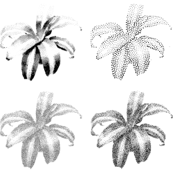

# StippleShop



## General
This repository contains the source code for the StippleShop program that we developed as part of our publication:

Domingo Martín, Germán Arroyo, Alejandro Rodríguez and Tobias Isenberg. A survey of digital stippling. Computer & Graphics 67: 24-44, 2017.
DOI: [10.1016/j.cag.2017.05.001](https://doi.org/10.1016/j.cag.2017.05.001). An open access paper version is [available on HAL](https://hal.science/hal-01528484).

If you use the code in this repository we would appreciate a citation of our paper.

## Bibtex
```
@article{Martin:2017:SDS,
  author      = {Domingo Mart{\'i}n and Germ{\'a}n Arroyo and Alejandro Rodr{\'i}guez and Tobias Isenberg},
  title       = {A Survey of Digital Stippling},
  journal     = {Computers \& Graphics},
  year        = {2017},
  volume      = {67},
  month       = oct,
  pages       = {24--44},
  doi         = {10.1016/j.cag.2017.05.001},
  doi_url     = {https://doi.org/10.1016/j.cag.2017.05.001},
  short_doi   = {10/gc6xf5},
  oa_hal_url  = {https://hal.science/hal-01528484},
  url         = {https://tobias.isenberg.cc/p/Martin2017SDS},
  github_url  = {https://github.com/dmperandres/StippleShop},
  pdf         = {https://tobias.isenberg.cc/personal/papers/Martin_2017_SDS.pdf},
}
```

## Project website and pre-compiled binaries
https://tobias.isenberg.cc/p/Martin2017SDS

This website also provides pre-compiled binary releases for both Windows and Linux. For instructions on how to use the tool see the [example tutorial section](#example-tutorial-to-create-a-simple-stippled-image) below.

## Note
Please note the software is provided "as is".  Use it at your own risk, although data loss is unlikely. Do take the standard precautions like saving your work in other programs.

## License
[GNU General Public License v3](https://www.gnu.org/licenses/gpl-3.0.en.html)
(see [license.txt](license.txt)).

## Requirements
This project compiles under Linux and Windows. In both cases the project requires these additional components:
* `Qt SDK` (libraries + QtCreator + MingGW compiler): https://www.qt.io/
* `OpenCV`: https://opencv.org/
* `CMake`: https://cmake.org/
* `GLEW`: https://glew.sourceforge.net/
Below we explain how these requirements are installed, both for Windows and Linux.

## Build process for Windows (tested under Windows 10 and 11)

### Installation of the compilation requirements under Windows
* (optional) install [7zip](https://7-zip.org/) and [Notepad++](https://notepad-plus-plus.org/)
* create a folder for the project; e.g., `C:\code`
* download the OpenCV library for Windows compiled for MinGW from GitHub (https://github.com/huihut/OpenCV-MinGW-Build), download [the x64 variant of version 4.5.5 as a zip file](https://github.com/huihut/OpenCV-MinGW-Build/archive/refs/tags/OpenCV-4.5.5-x64.zip) to `C:\code` and extract there, which creates the `OpenCV-MinGW-Build-OpenCV-4.5.5-x64` subdirectory (which should then contain folders `etc`, `include`, `x64`, and some files)
* download the binary 2.1.0 version of the GLEW library from https://glew.sourceforge.net/ and also save it to `C:\code` and extract there (the archive is called `glew-2.1.0-win32.zip` but also works with our 64 bit compilation), creating a subdirectory called `glew-2.1.0` (which should then contain folders `bin`, `doc`, `include`, `lib`, and a license file)
* download the binary [Qt](https://www.qt.io/) open-source online installer from https://www.qt.io/download-open-source and run it
  * this requires a free qt.io account
  * we recommend to install Qt to the default folder `C:\Qt`
  * select the "Qt 6.7 for desktop development" option
  * leave the rest of the dialogs on their defaults, accept the license, and install

### StippleShop Compilation under Windows
* get the StippleShop sources, e.g., by downloading a zip archive from [`https://github.com/dmperandres/StippleShop/archive/refs/heads/master.zip`](https://github.com/dmperandres/StippleShop/archive/refs/heads/master.zip) and then extracting the archive to `C:\code` (which creates a subdirectory `StippleShop-master` which, in turn, contains the directories `code` and `doc` and some files)
* in the main directory of the StippleShop code (`C:\code\StippleShop-master\code` or similar), edit the [```stippleshop.pro```](src/stippleshop.pro) project file with a text file editor ([Nodepad++](https://notepad-plus-plus.org/downloads/) or similar)
  * at the top, switch the compilation to Windows (uncomment ```DEFINES += WINDOWS``` and comment out ```DEFINES += LINUX```)
  * you also need to adjust the ```INCLUDEPATH``` paths to your respective library versions of OpenCV and GLEW (at the bottom of the file, in the `!linux {` section)
  * in our example these would look as follows:
    ```
    !linux {
    TARGET= StippleShop
    
    # change X:\XXXXX by your fdirectory to OpenCV and GLEW
    INCLUDEPATH += "C:\code\OpenCV-MinGW-Build-OpenCV-4.5.5-x64\include"
    INCLUDEPATH += "C:\code\OpenCV-MinGW-Build-OpenCV-4.5.5-x64\include\opencv2"
    INCLUDEPATH += "C:\code\glew-2.1.0\include"
    
    LIBS += -lopengl32 -L"C:\code\OpenCV-MinGW-Build-OpenCV-4.5.5-x64\x64\mingw\lib" -lopencv_core455 -lopencv_highgui455 -lopencv_imgcodecs455 -lopencv_imgproc455 -L"C:\code\glew-2.1.0\bin\Release\x64" -lglew32
    }
    ```
  * in the [```stippleshop.pro```](src/stippleshop.pro) project file you can also adjust the filters to be included. By default, however, you can leave these settings as they are.
* run QtCreator
* click "Open Project..." and load the [```stippleshop.pro```](src/stippleshop.pro) project file from `C:\code\StippleShop-master\code`
* click on the "Configure Project" button (this may take some time)
* in the bottom-left of the interface, find the monitor icon of QtCreator, click on it, and switch to "Release"
* initiate the build via Ctrl-B or Build > Build Project "stippleshop"
  * this will again take a few minutes
  * you can follow the process of the build by clicking the button "4 Compile Output" at the bottom of the window
  * also note that there are some warnings that are generated, but these do not prevent the project from being build
* after the compile process completes you can close QtCreator
* the StippleShop binary can be found in the folder `C:\code\StippleShop-master\code\build\Desktop_Qt_6_7_2_MinGW_64_bit-Release\release`
* to be able to run `StippleShop.exe`, you still need several DLLs and files; please get them as follows:
  * open a command line (click on the Windows Start button and then type `cmd` and hit enter) and then enter the following commands:
    ```
    cd C:\code\StippleShop-master\code\build\Desktop_Qt_6_7_2_MinGW_64_bit-Release\release
    C:\Qt\6.7.2\mingw_64\bin\windeployqt.exe StippleShop.exe
    ```
    then you can close the command line
  * manually copy `glew32.dll` from `C:\code\glew-2.1.0\bin\Release\x64` into the directory of the `StippleShop.exe`
  * manually copy `libgcc_s_seh-1.dll`, `libstdc++-6`, and `libwinpthread-1.dll` from `C:\Qt\Tools\mingw1120_64\bin` into the directory of the `StippleShop.exe`
  * manually copy `libopencv_core455.dll`, `libopencv_imgcodecs455.dll`, and `libopencv_imgproc455.dll` from `C:\code\OpenCV-MinGW-Build-OpenCV-4.5.5-x64\x64\mingw\bin` into the directory of the `StippleShop.exe`
  * manually copy the `C:\code\StippleShop-master\code\dots` with all its contents into the directory of the `StippleShop.exe`
  * manually copy the `C:\code\StippleShop-master\code\images` with all its contents into the directory of the `StippleShop.exe`
  * this completes the process; you can now package the complete contents of the `C:\code\StippleShop-master\code\build\Desktop_Qt_6_7_2_MinGW_64_bit-Release\release` folder as the binary distribution of StippleShop
* _continue below in the [Example tutorial section](#example-tutorial-to-create-a-simple-stippled-image)_

## Build process for Linux (tested with [Kubuntu](https://kubuntu.org/) 22.04.3 & [Linux Mint](https://linuxmint.com/) 21.3)

### Installation of the requirements under Linux
* update your environment: `sudo apt update ; sudo apt upgrade`
* install the compiler and other complementary tools: `sudo apt install build-essential libxcb-cursor0 cmake cmake-qt-gui wget git`
* create a folder to place all the necessary code and libraries and change to that folder: `cd ~ ; mkdir code ; cd code`
* now we get and compile [OpenCV](https://opencv.org/)
  * download the sources: `wget https://github.com/opencv/opencv/archive/4.9.0.zip`
  * unzip the downloaded archive: `unzip 4.9.0.zip`
  * change the name of the created folder: `mv opencv-4.9.0 opencv-4.9`
  * create a new folder to hold the created library: `mkdir opencv-4.9.0`
  * change to the sources directory: `cd opencv-4.9`
  * create a new folder to hold the object code: `mkdir build`
  * start the CMake GUI: `cmake-gui`
  * click the "Browse Source..." button and select the "sources" folder of OpenCV, by default this should be `/home/user/code/opencv-4.9` with `user` being your Linux user name
  * click the "Browse Build..." button and select the "build" folder you previously created for OpenCV, by default this should be `/home/user/code/opencv-4.9/build`
  * click the "Configure" button and select "Unix Makefiles" from the drop-down list, leave "Use native compilers" selected, then click the "Finish" button
  * this runs some processes and then shows some options; from these options select BUILD_JPEG and BUILD_PNG, in addition to the already selected ones
  * specify where the library and complementary files will be placed for a local installation: in the field CMAKE_INSTALL_PREFIX change `/usr/local` to `/home/user/code/opencv-4.9.0`
  * click the "Generate" button to generate the Makefiles, then close the CMake GUI window
  * back in the command line, change to build folder: `cd build`
  * compile OpenCV by running `make` (depending on your machine and its processors it could be done quicker with the `-j` option and specifying the number of threads to use; e.g., `make -j4`); this process may take quite a while ...
  * finally do the local installation: `make install`
  * this should have added the compiled OpenCV to `~/code/opencv-4.9.0`
* now we get and and compile [GLEW](https://glew.sourceforge.net/)
  * change back to the code directory: `cd ~/code`
  * download the sources: `wget https://sourceforge.net/projects/glew/files/glew/2.1.0/glew-2.1.0.zip/download -O glew.zip`
  * unzip the downloaded archive: `unzip glew.zip`
  * rename the generated archive to avoid errors with the installation later: `mv glew-2.1.0 glew-2.1`
  * create a folder for the resulting installation: `mkdir glew-2.1.0`
  * now we need to make sure that the OpenGL drivers are in place
    * if you follow this process on a real machine then the needed OpenGL drivers and development files for X11 should be installed already; nothing do to at this point
    * if, in contrast, you follow this process in a virtual machine then we have to install the needed OpenGL drivers and development files for X11 (using free drivers): run `sudo apt install freeglut3-dev libx11-dev`
  * change to the GLEW sources folder: `cd glew-2.1`
  * edit the Makefile to specify Makefile a local installation instead of a global one: `nano Makefile`, look for `GLEW_DEST`, change `/usr` to `/home/user/code/glew-2.1.0` (adjust the `user` to your own login name), save the file with Ctrl-O, and then exit nano with Ctrl-X
  * compile GLEW: `make`
  * install GLEW: `make install`
* now we get [Qt](https://www.qt.io/)
  * open a browser and go to [`https://www.qt.io/download-open-source?hsLang=en`](https://www.qt.io/download-open-source?hsLang=en)
  * scroll down to find the "Download the Qt Online Installer" button and click it
  * select Linux and click on the "Qt Online Installer for Linux (64-bit)" button to download the install script
  * change to folder where you saved the downloaded script, make the script executable, and run it; e.g., `cd ~/Downloads ; chmod 755 qt-online-installer-linux-x64-4.8.0.run ; ./qt-online-installer-linux-x64-4.8.0.run` (you may need to adjust the name of the install script if it has changed in the meantime)
  * this opens a dialog to configure the Qt installation
  * you need a Qt account to proceed on the first screen, so either use your existing account or generate a new account; then "Next >"
  * agree to the license on the next screen, either enter a company name or check the box that states that you are an individual, then "Next >"
  * simply "Next >" on the Welcome dialog
  * make a decision on the Contribution to Qt Development dialog, then "Next >"
  * in the Installation folder dialog, specify the target directory; e.g., `/home/user/code/Qt` (change `user` to your user name)
  * also leave the "Custom installation" box checked, then click "Next >"
  * in the Components tree, unselect "Qt Design Studio > Qt Design Studio X.Y.Z" and select "Qt > Qt 6.7.2"; in addition
  * if there are space issues, you can also unselect items that you do not need:
    * under the "Qt > Qt 6.7.2" subtree, you can de-select everything except "Desktop" and "Qt 5 Compatibility Module"
    * on the right side unselect "Preview"
  * add any additional components you may want, but leave the rest of the pre-selections as they are, then click "Next >"
  * in the License Agreement dialog, check the box that you agree to the license conditions, then click "Next >"
  * click "Next >" to start the installation of Qt (if you do not have enough disk space then "Next >" is greyed out)
  * once it is done, you can close the installation dialog

### StippleShop Compilation under Linux
* get the StippleShop sources: `cd ~/code ; git clone https://github.com/dmperandres/StippleShop.git`
* change to the main directory of the StippleShop code: `cd ~/code/StippleShop/code`
* edit the [```stippleshop.pro```](src/stippleshop.pro) project file; e.g., `nano stippleshop.pro`
  * at the bottom of the file, adjust the ```INCLUDEPATH``` and ```LIBS``` paths to your respective user name and to your library versions of OpenCV and GLEW (update `user` to your Linux user name):
  ```
  INCLUDEPATH += /home/user/code/opencv-4.9.0/include/opencv4
  INCLUDEPATH += /home/user/code/opencv-4.9.0/include/opencv4/opencv2
  INCLUDEPATH += /home/user/code/glew-2.1.0/include
  INCLUDEPATH += $$PWD/shaders
  INCLUDEPATH += $${FILE_IO_PATH}
  INCLUDEPATH += $${COMMON_CLASSES_PATH}
  
  LIBS += \
      -L/home/user/code/glew-2.1.0/lib64 -lGLEW \
      -L/home/user/code/opencv-4.9.0/lib -lopencv_core -lopencv_highgui \
      -lopencv_imgproc -lopencv_imgcodecs \
      -lGL
  ```
  * in the [```stippleshop.pro```](src/stippleshop.pro) project file you can also adjust the filters to be included. By default, however, you can leave these settings as they are.
  * once done with the edits in [```stippleshop.pro```](src/stippleshop.pro), save it and exit the editor
* run QtCreator: `cd ~/code ; Qt/Tools/QtCreator/bin/qtcreator`
* open StippleShop project via "File > Open file or project..." and find the [```stippleshop.pro```](src/stippleshop.pro) in the folder ```~/code/StippleShop/code```
* click on the "Configure Project" button
* in the bottom-left of the interface, find the monitor icon of QtCreator, click on it, and switch to "Release"
* click on the "stippleshop [master]" project object in the list on the left, then in the vertical toolbar further to the left click on "Projects" (the one with wrench icon), and in the dialog that opens up unselect "Shadow build"
* if you want you can also edit/further adjust the [```stippleshop.pro```](src/stippleshop.pro) project file here, by clicking on the "Edit" icon on the vertical toolbar on the very left (the one with the document icon), then unfolding the tree under the "stippleshop [master]" project object, and double-clicking the [```stippleshop.pro```](src/stippleshop.pro) project file; make sure to save the project file done (Ctrl-S or File > Save stippleshop.pro)
* initiate the build via Ctrl-B or Build > Build Project "stippleshop"
  * this will again take a few minutes
  * you can follow the process of the build by clicking the button "4 Compile Output" at the bottom of the window
  * also note that there are some warnings that are generated, but these do not prevent the project from being build
* after the compile process completes you can close QtCreator
* the StippleShop binary can be found at `~/code/StippleShop/code/stippleshop`, yet it relies on some shared libraries; so to start it reliably we create a shell script thay adds the necessary paths (which you can adjust as needed, also by permanently moving the shared libaries):
  * `cd ~/code/StippleShop/code/ ; nano ./stippleshop.sh`
  * add this text (notice that you need to update `user` to your Linux user name)
  ```
  #!/bin/bash
  export LD_LIBRARY_PATH=$LD_LIBRARY_PATH:/home/user/code/glew-2.1.0/lib64
  export LD_LIBRARY_PATH=$LD_LIBRARY_PATH:/home/user/code/opencv-4.9.0/lib
  ./stippleshop
  ```
  * make the shell script executable: `chmod 755 stippleshop.sh`
  * assuming that the `stippleshop.sh` and the `stippleshop` binary are and remain in the same directory, then you can run StippleShop by simply calling `~/code/StippleShop/code/stippleshop ; ./stippleshop.sh`
* _continue below in the [Example tutorial section](#example-tutorial-to-create-a-simple-stippled-image)_

## Example tutorial to create a simple stippled image
0. If you run the tool within a virtual machine such as [VirtualBox](https://www.virtualbox.org/), you may need to disable 3D accelleration (disable the option "Enable 3D Acceleration" in the [VirtualBox](https://www.virtualbox.org/) settings) for StippleShop to run smoothly (depends on your host machine).
1. first let's see how the interaction works in general: watch [the included video demonstration](doc/stippleshop_demo.mp4)
2. then let's recreate some part of the paper using exactly this example, specifically details from Figure 16; so run the compiled binary (and enlarge or full-screen the window)
3. select File > New effect; this creates two starting blocks in the workspace
4. first drag and drop the "Halftoning > Ostromoukhov" filter from the list on the left into the workspace; this will generate the locations for the stipples
5. then drag and drop the "Placement and Stippling > Example-Based Grayscale" filter from the list on the left into the workspace; this will generate the actual stippling
6. connected the output of the "GRAY" starting block to the input of the newly created "HALFTONING_OST" block, and its output to the input of the "STIPPLING EBG" block
7. click on the "Results" tab at the top-left (if the tool crashes here, then you may be in a VR with 3D rendering issues; try again outside of the VM using the compiled tool and all its needed DLLs and files)
8. load the source image via File > Open input image and select the `images\frog_512.png` example image
9. in the Images tab on the top-right, select the stippling channel: `halftoning_ost_0`, you should see the halftoning result
10. select the correct channel: `stippling_ebg_1`, and you should see the stippling result
11. using Ctrl-mousewheel, zoom into the center region of the image, as indicated in the subfigures of Figure 16 of the paper
12. from the tabs on the top-right, select "Filters", select the `stippling_ebg_1` filter, and change the pixel resolution to 1200ppi
13. the resulting images resemble the ones from the figure, albeit with a different random placement of the stipple dots due to different seeding

For further documentation on other use and the different functionality see the detailed description in the [```StippleShop_manual.pdf```](doc/StippleShop_manual.pdf) manual.
